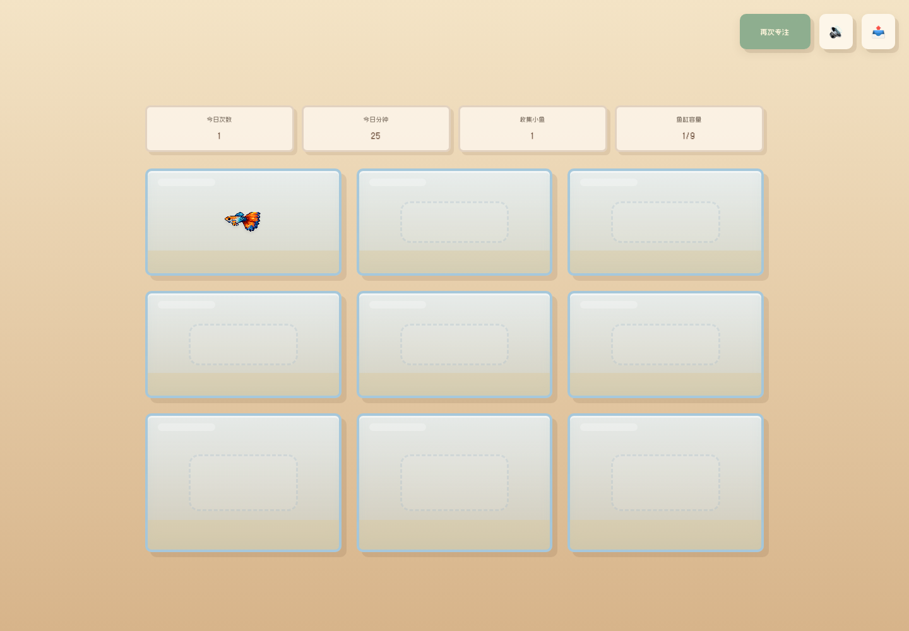

# Daily Aquarium

Version: 1.0

Daily Aquarium is a gentle Pomodoro-style focus timer. Users enter one small goal, complete a timed focus session, and receive a collectible pixel fish as positive reinforcement.



## Why This Project

Daily Aquarium explores a calmer approach to productivity. Instead of long task lists, pressure-heavy streaks, or failure states, it focuses on one small goal at a time and rewards completion with a quiet collectible aquarium.

The project is designed as a portfolio-friendly MVP for productivity, wellbeing, and focus-app roles.

## Features

- One-goal focus flow
- 15 / 25 / 50 minute duration choices
- Temporary 5-second test mode for faster local testing
- Start, pause, resume, and reset timer controls
- Gentle interruption and reset copy
- Fish rewards after completed focus sessions
- Clickable fish history with task, date, time, duration, fish name, and description
- Aquarium progress stats:
  - Today sessions
  - Today focus minutes
  - Total collected fish
  - Tank capacity
- Local persistence with `localStorage`
- Basic accessibility support for labels, buttons, live regions, keyboard flow, focus states, and reduced motion

## Run Locally

No build step is required.

1. Clone or download the repository.
2. Open `index.html` in a browser.
3. Enter one focus goal.
4. Choose 15, 25, or 50 minutes.
5. Click `开始`.

For development testing, all duration choices currently run as 5 seconds in `script.js`:

```js
const TEST_DURATION_SECONDS = 5;
```

To restore real Pomodoro durations later, replace the test duration assignment with the selected minutes converted to seconds.

## Project Structure

```text
.
├── index.html
├── style.css
├── script.js
├── assets/
│   ├── bg/
│   ├── fish/
│   ├── fonts/
│   └── screenshots/
└── Daily Aquarium 产品文档（PRD）_副本.md
```

## Data Stored Locally

The app stores progress in browser `localStorage`:

- `sessionHistory` - completed focus sessions
- `tanks` - fish placed in tanks with linked session snapshots
- `collectedFishIds` - collected fish species

You can inspect completed sessions in the browser console:

```js
getDailyAquariumSessions()
```

## Accessibility Notes

This version includes:

- Visible keyboard focus states
- Screen-reader labels for form inputs and controls
- `aria-live` regions for timer and gentle status messages
- Keyboard-accessible reward claiming and fish history dialogs
- Focus return after closing the fish history dialog
- Reduced-motion support through `prefers-reduced-motion`

## Portfolio Positioning

Daily Aquarium can be described as:

> A calming Pomodoro-style focus timer with configurable focus durations, pause/resume/reset controls, local session history, progress tracking, and collectible fish rewards to support low-pressure task completion.

